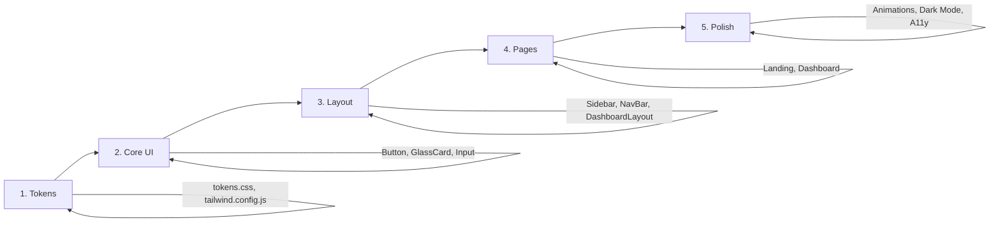

# Atlas UI Design System - Implementation Plan

## Goal

Create a **Minimal Modern UI** with:

- Notion-style dashboard layout (clean, minimal, 2-column)
- Soft pastel gradient + glassmorphism aesthetic
- Production-ready design tokens, CSS, Tailwind, and React components

---

## Design Analysis (from reference images)

### Image A: Notion Client Management

| Aspect | Details |
|--------|---------|
| **Layout** | Left sidebar + main content grid |
| **Colors** | White background, subtle gray borders, minimal chrome |
| **Cards** | Rounded corners, soft shadows, clean typography |
| **Icons** | Outline stroke style, minimal |

### Image B: Fintech Landing

| Aspect | Details |
|--------|---------|
| **Background** | Soft pastel gradient (pink → blue → peach) |
| **Cards** | Glassmorphism with white blur, subtle borders |
| **Typography** | Clean sans-serif, bold headlines |
| **CTAs** | Solid buttons with soft shadows |

---

## Proposed Changes

### Phase 1: Project Structure

#### [NEW] `client/src/styles/tokens.css`

Design tokens as CSS custom properties:

- Color palette (primary, neutral, accent gradient)
- Glass card properties (rgba, blur, border)
- Typography scale, spacing, shadows, radii

#### [NEW] `client/tailwind.config.js`

Extended theme with:

- Custom colors mapped to CSS vars
- Spacing scale (4px modular)
- Custom screens for responsive

#### [NEW] `client/src/styles/_tokens.scss`

SCSS variables + mixins for glass effects

---

### Phase 2: Core Components

#### [NEW] `client/src/components/ui/Button.jsx`

```jsx
// Variants: primary, secondary, ghost, icon
// States: hover, focus, active, disabled
// Uses tokens: --primary, --primary-hover, --radius-base
```

#### [NEW] `client/src/components/ui/GlassCard.jsx`

```jsx
// Props: variant (default, accent), className
// Uses: --glass-bg, --glass-border, backdrop-filter
```

#### [NEW] `client/src/components/ui/Input.jsx`

```jsx
// Variants: default, glass
// States: focus, error, disabled
```

#### [NEW] `client/src/components/ui/Tag.jsx`

```jsx
// Pill-style tags for labels/categories
```

---

### Phase 3: Layout Components

#### [NEW] `client/src/components/layout/Sidebar.jsx`

```jsx
// Notion-style left rail navigation
// Collapsible on mobile
// Icons + text labels
```

#### [NEW] `client/src/components/layout/NavBar.jsx`

```jsx
// Top nav for landing pages
// Logo, links, CTA button
```

#### [NEW] `client/src/components/layout/DashboardLayout.jsx`

```jsx
// 2-column layout wrapper
// Sidebar + main content area
```

---

### Phase 4: Feature Components

#### [NEW] `client/src/components/sections/HeroSection.jsx`

```jsx
// Gradient background
// Glass CTA cards
// Headline + description
```

#### [NEW] `client/src/components/ui/Modal.jsx`

```jsx
// Glass variant modal
// Accessible with aria attributes
```

#### [NEW] `client/src/components/ui/Toast.jsx`

```jsx
// Notification toasts
// Success, error, info, warning variants
```

---

### Phase 5: Page Templates

#### [NEW] `client/src/app/page.jsx` (Landing)

- Hero with gradient + glass cards
- Features section
- CTAs

#### [NEW] `client/src/app/dashboard/page.jsx`

- Sidebar layout
- Dashboard widgets
- Stats cards

---

## File Structure

```
client/
├── src/
│   ├── styles/
│   │   ├── tokens.css          # CSS variables
│   │   ├── _tokens.scss        # SCSS tokens
│   │   ├── globals.css         # Global styles
│   │   └── components.css      # Component utilities
│   ├── components/
│   │   ├── ui/
│   │   │   ├── Button.jsx
│   │   │   ├── GlassCard.jsx
│   │   │   ├── Input.jsx
│   │   │   ├── Tag.jsx
│   │   │   ├── Modal.jsx
│   │   │   └── Toast.jsx
│   │   ├── layout/
│   │   │   ├── Sidebar.jsx
│   │   │   ├── NavBar.jsx
│   │   │   └── DashboardLayout.jsx
│   │   └── sections/
│   │       └── HeroSection.jsx
│   └── app/
│       ├── page.jsx            # Landing page
│       ├── layout.jsx          # Root layout
│       └── dashboard/
│           └── page.jsx        # Dashboard page
├── tailwind.config.js
├── package.json
└── README.md
```

---

## Key Design Tokens

### Colors

| Token | Value | Usage |
|-------|-------|-------|
| `--primary` | `#6366F1` | Primary brand |
| `--primary-hover` | `#4F46E5` | Hover state |
| `--bg` | `#FAFAFA` | Page background |
| `--surface` | `#FFFFFF` | Card backgrounds |
| `--muted` | `#6B7280` | Muted text |
| `--accent-start` | `#FBE8FF` | Gradient start (pink) |
| `--accent-mid` | `#E2F0FF` | Gradient mid (blue) |
| `--accent-end` | `#FFDDE7` | Gradient end (peach) |

### Glass Effect

| Token | Value |
|-------|-------|
| `--glass-bg` | `rgba(255,255,255,0.55)` |
| `--glass-border` | `rgba(255,255,255,0.28)` |
| `--glass-blur` | `14px` |

### Typography

- **Font:** Inter, system fallback
- **Scale:** 12, 14, 16, 18, 20, 24, 30, 36, 48px

### Spacing

- **4px modular:** 4, 8, 12, 16, 20, 24, 32, 40, 48, 64

---

## Verification Plan

### 1. Visual Verification (Manual)

**Steps:**

1. Start dev server: `cd client && npm run dev`
2. Open `http://localhost:5173` in browser
3. Verify landing page matches gradient + glass aesthetic
4. Navigate to `/dashboard` and verify Notion-style layout
5. Check responsive behavior at 320px, 768px, 1280px widths
6. Test dark mode toggle
7. Verify keyboard navigation for all interactive elements

### 2. Component Storybook (Optional)

If Storybook is set up:

```bash
cd client && npm run storybook
```

Verify each component renders correctly with all variants.

### 3. Accessibility Check

- Run Lighthouse accessibility audit in Chrome DevTools
- Target score: **90+** for accessibility
- Verify color contrast meets **WCAG AA (4.5:1)**

### 4. Build Verification

```bash
cd client && npm run build
```

Ensure no build errors and CSS is properly compiled.

---

## Implementation Order



1. **Tokens first** → `tokens.css`, `tailwind.config.js`
2. **Core UI components** → Button, GlassCard, Input
3. **Layout components** → Sidebar, NavBar, DashboardLayout
4. **Page templates** → Landing, Dashboard
5. **Polish** → Animations, dark mode, accessibility

---

## Notes

> [!IMPORTANT]
> - Using **Next.js 15** with App Router as per project docs
> - **Tailwind CSS** for utility classes
> - **CSS variables** for theming flexibility

> [!TIP]
> - React functional components with JSX
> - Prioritize **mobile-first** responsive design
> - Keep components focused and reusable

---

*Document created: January 2, 2026*
